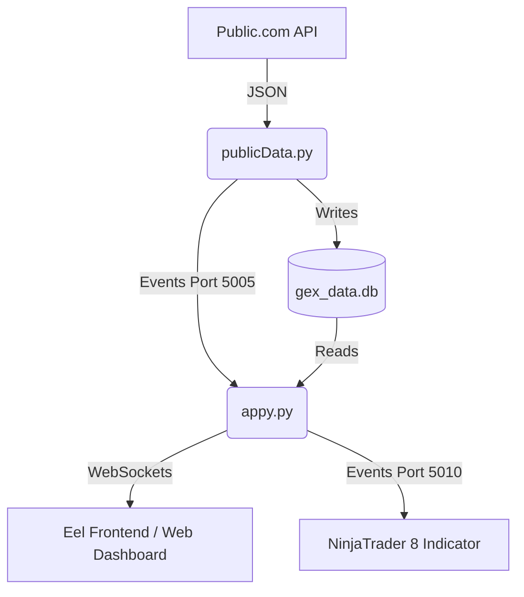

# PublicGex OSS Dashboard

Welcome to the **PublicGex OSS Dashboard**, a real-time market regime analysis tool powered by 0DTE Option Gamma Exposure (GEX).

## Purpose
This project bridges the gap between raw option chain data (from Public.com) and actionable trading signals in NinjaTrader 8. It calculates "Gamma Flips," "Magnets," and "Market Regimes" (e.g., Grind Up vs. Crash) in real-time.

## System Architecture

The system consists of four main components interacting via TCP sockets and SQLite.

### 1. Data Collector (`publicData.py`)
*   **Role**: Polls the Public.com API for option chains.
*   **Logic**: Filters for 0DTE, calculates Greeks, Net GEX, and Flip Points.
*   **Output**: Saves granular data to `gex_data.db`.

### 2. Backend Server (`appy.py`)
*   **Role**: The central nervous system.
*   **Logic**: Aggregates data from the DB into a "Market Compass" (Trend vs. Volatility).
*   **Output**: Serves the UI and broadcasts signals to NinjaTrader.

### 3. Broadcaster (`ninjatrader_broadcaster.py`)
*   **Role**: A dedicated TCP server.
*   **Logic**: Converts Python dictionaries into flat JSON strings that C# can easily parse.

### 4. Utilities (`event_utils.py`)
*   **Role**: Lightweight IPC (Inter-Process Communication).
*   **Logic**: Allows the collector to "poke" the backend when new data arrives.

## Getting Started

See [Setup Guide](setup.md) to configure your environment.
